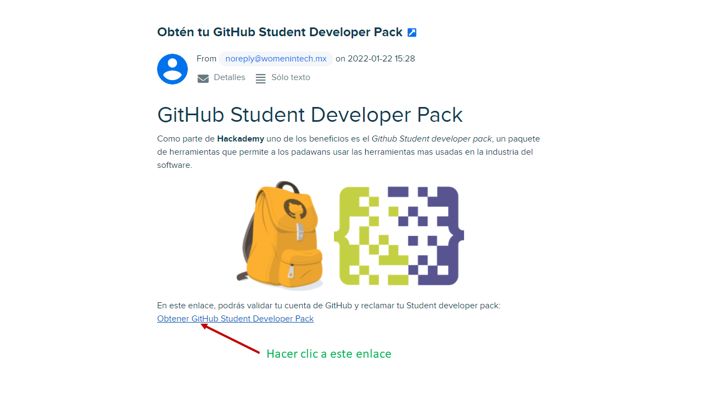
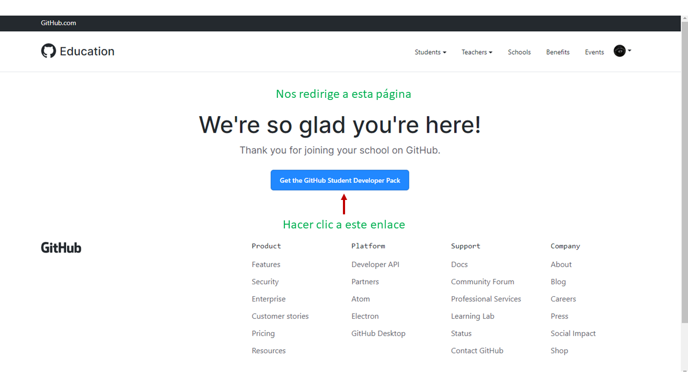
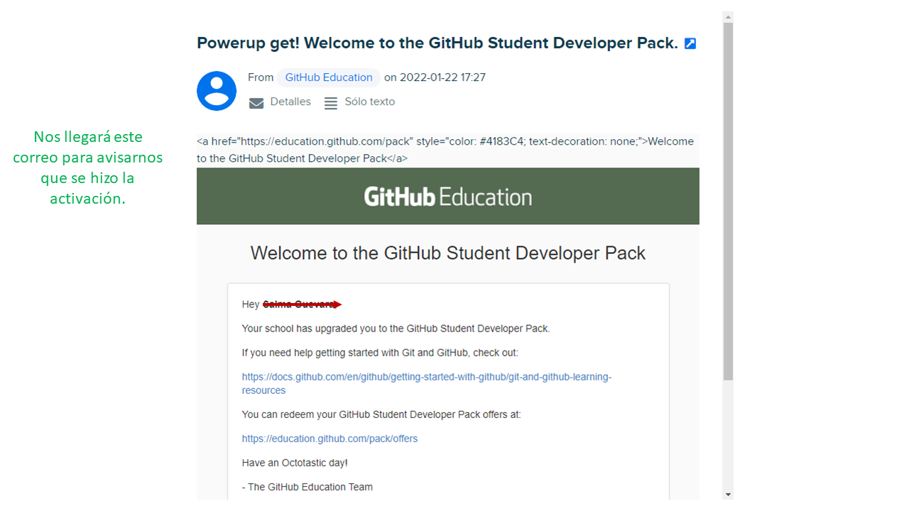
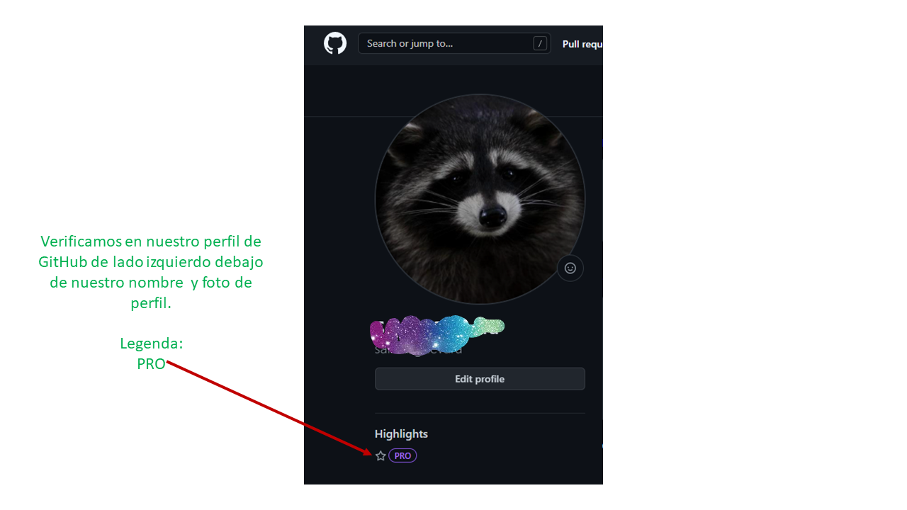
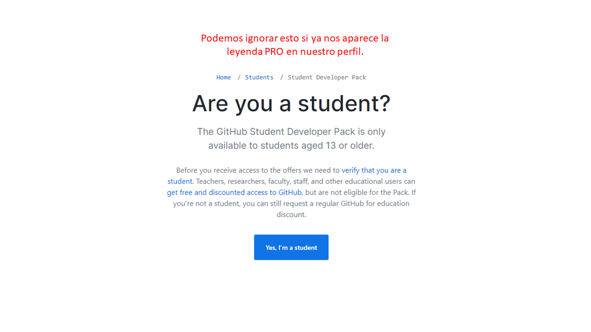

# Activación GH_Student_Dev_Pack
 Manual para activar el GitHub Student Developer Pack

### Hola compañeras, espero que esto les pueda ayudar con la activación de su GitHub Student Developer Pack.👌
**IMPORTANTE: Debemos tener iniciada nuestra sesión de GitHub en el navegador que estemos usando**

**Paso 1: Abrir nuestro correo Hackademy**
Ingresamos nuestros datos (correo y contraseña).

**Paso 2: Revisar el correo que nos enviaron**
El asunto del correo dice: Obtén tu GitHub Student Developer Pack. Debemos dar clic al enlace señalado.

**Paso 3: Nos abre una nueva página**
Debemos dar clic en el botón señalado (Get the GitHub Student Developer Pack).

**Paso 4: Volver a revisar nuestro correo Hackademy**
Nos llegará un correo de bienvenida. No es necesario abrir ninguno de los enlaces.

**Paso 5: Verificación en perfil de GitHub**
Entramos a nuestro perfil de GitHub y de lado izquierdo, debajo de nuestro nombre e imagen de perfil, nos debe aparecer la leyenda "PRO", en la sección de Highlights. 

**BONUS: ¿Qué hago con esto?**
Si ya confirmamos que nos aparece la leyenda PRO del paso anterior, podemos hacer caso omiso de esta pestaña. 

**Espero la información les sea de utilidad! Que el código las acompañe.** 

